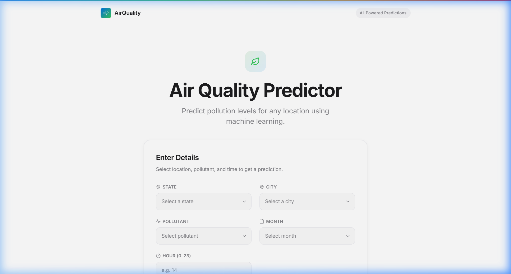
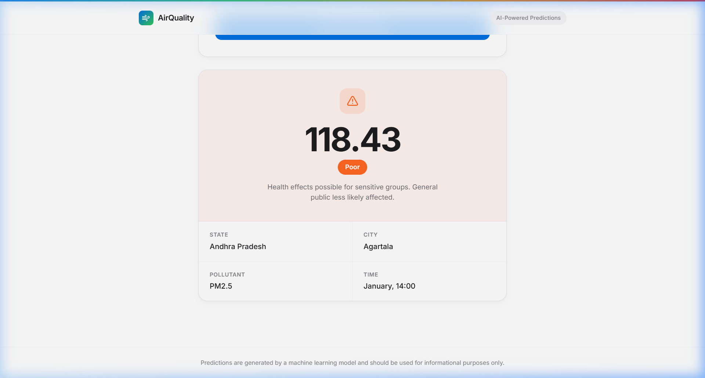

<p align="center">
  
</p>

<h1 align="center">Air Quality Predictor</h1>

<p align="center">
  <b>Predict pollution levels for any Indian city using Machine Learning</b>
</p>

<p align="center">
  
  
  
  
  
</p>

<br />

<p align="center">
  
</p>

<p align="center">
  
</p>

---

## ✨ Overview

**Air Quality Predictor** is a full-stack web application that uses a trained machine learning model to predict pollution levels across **254 cities** and **30 states** in India. Users select a location, pollutant type, and time — and the app returns a real-time prediction with a health category.

The frontend features a clean, Apple-inspired design with smooth animations, while the backend runs a pre-trained model served via a Flask REST API.

---

## 🧠 Features

| Feature | Description |
|---|---|
| 🤖 **ML-Powered Predictions** | Uses a trained model (`RandomForest` / `GradientBoosting`) to predict pollutant concentrations |
| 🌍 **254 Cities, 30 States** | Coverage across all major Indian cities with latitude/longitude-aware predictions |
| 🧪 **6 Pollutants** | Supports PM2.5, PM10, NO₂, SO₂, CO, and O₃ |
| 🎨 **Premium UI** | Clean, Apple-inspired design with smooth Framer Motion animations |
| 🏷️ **Health Categories** | Results classified as **Good**, **Moderate**, **Poor**, or **Severe** with color-coded badges |
| ⚡ **Real-time API** | Fast Flask backend with CORS-enabled REST endpoints |

---

## 🛠️ Tech Stack

### Frontend
- **React 19** — Component-based UI
- **Vite 7** — Lightning-fast dev server & bundler
- **Tailwind CSS 4** — Utility-first styling
- **Framer Motion** — Smooth UI animations
- **Axios** — HTTP client for API calls
- **Lucide React** — Premium icon set

### Backend
- **Python 3.10+** — Core language
- **Flask** — Lightweight REST API framework
- **Pandas** — Data manipulation
- **Joblib** — Model serialization
- **Scikit-learn** — Machine learning model

---

## 📁 Project Structure

```
Air-Quality-Prediction/
├── backend/
│   ├── app.py                  # Flask API server
│   ├── airquality.csv          # Training dataset
│   ├── airquality.ipynb        # Model training notebook
│   └── models/
│       ├── airquality_model.pkl    # Trained ML model
│       └── model_columns.pkl       # Feature column list
├── frontend/
│   ├── index.html
│   ├── package.json
│   ├── vite.config.js
│   ├── postcss.config.js
│   └── src/
│       ├── App.jsx             # Main application component
│       ├── main.jsx            # Entry point
│       └── index.css           # Global styles & design system
├── screenshots/
│   ├── hero.png
│   └── prediction.png
└── README.md
```

---

## 🚀 Getting Started

### Prerequisites

- **Python 3.10+** with pip
- **Node.js 18+** with npm

### 1. Clone the Repository

```bash
git clone https://github.com/Gagan021/Air-Quality-Prediction-.git
cd Air-Quality-Prediction-
```

### 2. Setup Backend

```bash
cd backend
pip install flask flask-cors pandas joblib scikit-learn
python app.py
```

The API server will start at **http://localhost:5000**.

### 3. Setup Frontend

```bash
cd frontend
npm install
npm run dev
```

The app will be available at **http://localhost:5173**.

---

## 📡 API Endpoints

### `GET /`
Health check endpoint.

**Response:**
```json
{ "Backend": "Running" }
```

### `GET /metadata`
Returns all available states and cities for the dropdown menus.

**Response:**
```json
{
  "states": ["Andhra_Pradesh", "Bihar", "Delhi", ...],
  "cities": ["Agartala", "Agra", "Ahmedabad", ...]
}
```

### `POST /predict`
Returns the predicted pollution level and health category.

**Request Body:**
```json
{
  "state": "Delhi",
  "city": "Delhi",
  "pollutant_id": "PM2.5",
  "hour": 14,
  "month": 1
}
```

**Response:**
```json
{
  "predicted_pollution": 216.63,
  "category": "Severe"
}
```

---

## 🎯 AQI Categories

| Range | Category | Description |
|---|---|---|
| 0 – 50 | 🟢 **Good** | Air quality is satisfactory with little or no risk |
| 51 – 100 | 🟡 **Moderate** | Acceptable; some pollutants may concern sensitive groups |
| 101 – 200 | 🟠 **Poor** | Health effects possible for sensitive groups |
| 200+ | 🔴 **Severe** | Health alert: everyone may experience serious effects |

---

## 📊 Dataset

The model is trained on the **Indian Air Quality Dataset** containing:

- **377K+ records** across Indian monitoring stations
- Features: `state`, `city`, `station`, `latitude`, `longitude`, `pollutant_id`, `pollutant_min`, `pollutant_max`, `pollutant_avg`
- Temporal features (`hour`, `month`) extracted from `last_update` timestamps

---

## 🙏 Acknowledgements

- Dataset sourced from Indian government air quality monitoring stations
- UI inspired by Apple's design language
- Built with open-source tools and libraries

---

<p align="center">
  Made with ❤️ by <a href="https://github.com/Gagan021">Gagan</a>
</p>
